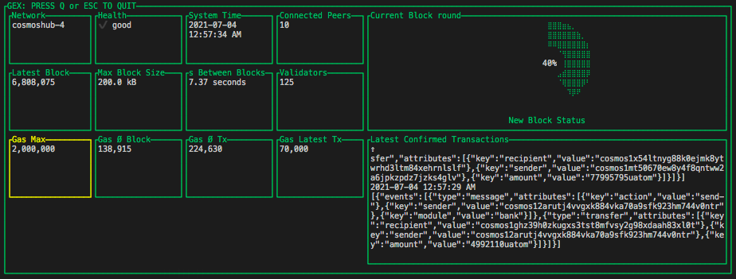

## GEX In-Terminal Gaia Explorer

GEX is a real time in-terminal explorer for Cosmos SDK blockchains. See the [Check out your Cosmos SDK blockchain in a terminal-based block explorer](https://blog.cosmos.network/gaia-explorer-in-terminal-f37a4ea52e3c) blog post to learn more about GEX.

The GEX explorer displays blocks, transactions, validator, network status, and more information. Use the GEX block explorer to see the status of peers, connection, version, and other useful information to have a quick peek into your own node. GEX works with Starport.

## Install GEX

The GEX installation requires Go. If you don't already have Go installed, see https://golang.org/dl. Download the binary release that is suitable for your system and follow the installation instructions.

To install the GEX binary:

`go install github.com/cosmos/gex@latest`

## Run GEX

To launch a GEX explorer in your terminal window, type:

`gex`

and hit enter.

## Optional Port

Configure an optional port, instead of using the default RPC port `26657`

`gex -p 27657`

## Preview

## Run In Development

To manually run GEX, clone the `github.com/cosmos/gex` repository and then cd into the `gex` directory. Then to run GEX manually, type this command in a terminal window:

`go run main.go`

## Contribute

See [CONTRIBUTING.md](./CONTRIBUTING.md) to learn about how to contribute and how the code is structured.

Thanks for contributing!
